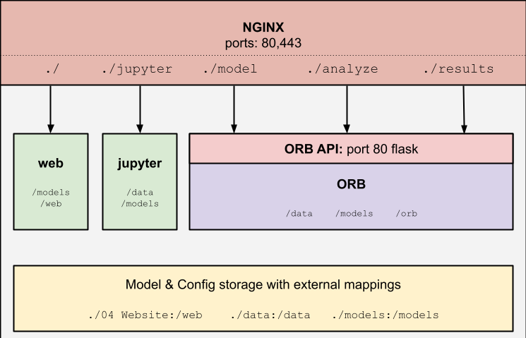

# orb
Occupant Responsive Buildings

# System specification
---

1. *Data collection* is assumed to have been addressed through a data-warehousing method such as SkyFoundry's Skyspark or OSIsoft's PI applications. 

2. *Data cleansing* 

# API Reference
---
Following OpenAPI Specification: https://github.com/OAI/OpenAPI-Specification/tree/main/examples/v3.1

# Docker container structure
---
