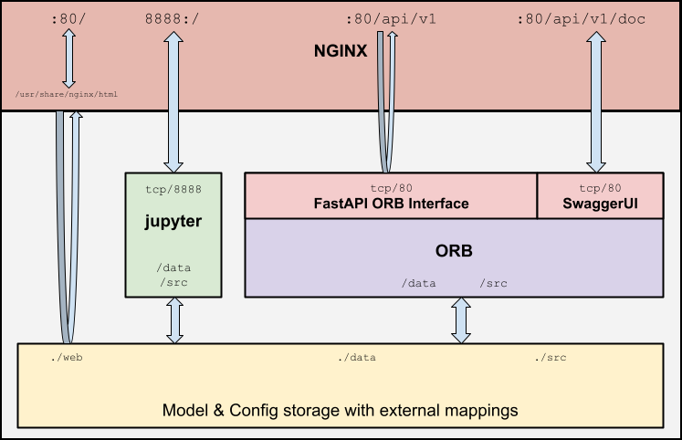

This software infers occupancy patterns in buildings utilizing Wi-Fi device connection statistics. It inputs numerical counts of devices connected to the wireless access points within a building and outputs estimated periods of occupancy. This proof-of-concept application is implemented as a REST API tailored to perform inference on data fed to it from an Energy Management and Information System ([EMIS](https://buildings.lbl.gov/emis/building-energy-information-systems)).  Sample application code is provided for the [Skyspark](https://skyfoundry.com/product) platform.

### U.C. Berkeley MIDS Capstone Project details
This repository was developed by Ryan Belfer, Clayton Monis, Laura Treider and Chris Weyandt as a Capstone project for the Masters of Information and Data Science ([MIDS](https://ischoolonline.berkeley.edu/data-science/)) degree program at the University of California, Berkeley. Please visit the [official project webpage](https://people.ischool.berkeley.edu/~ltreider/orbs/index.html) for additional information on our Capstone project. 

### Data
The dataset used in this exploration was provided by [Sustainable Berkeley Lab](https://sbl.lbl.gov/) in a collaborative effort to develop inovative new tools for managing the energy performance of facilities at Lawrence Berkeley National Laboratory's campus in Berkeley, California, USA. The tools are actively deployed in dozens of buildings by SBL's [Ongoing Commissioning](https://ocx.lbl.gov) team. All data sources were anonymized prior to analysis and remain unpublished for privacy reasons, however small samples of data are present throughout this repository. Explorations of the various data sources can be found in the [examples/notebooks](examples/notebooks) directory.

WiFi data collection is performed using the [COUNT](https://github.com/LBNL-ETA/COUNT) software developed by Lawrence Berkeley National Laboratory's [Environmental Technologies Area](https://eta.lbl.gov/) researchers. Data is collected every 5 minutes via SNMP queries to wireless access points, anonymized, and stored in a database for further analysis. 

### Motivation
This software was developed to provide an intuitive means for analyzing the operating schedules of building HVAC systems. Most HVAC systems operate on pre-determined time-of-day schedules, and many of these schedules remain unchanged for years. The COVID-19 pandemic has dramatically changed occupancy patterns in buildings as attempts at reducing occupant density lead to increased telework and modified shift schedules. Facility operators are increasing air exchange rates and lengthening operating schedules to accommodate public health concerns, often resulting in higher energy consumption for buildings with fewer occupants. Many HVAC systems lack the ability to sense whether a building is occupied or vacant, so a tool that can provide this information utilizing existing data sources is quite attractive for energy management purposes.

### Acknowledgements
ORB Team - Ryan, Clayton, Laura, Chris  
SBL - John & Raph  
COUNT - Marco, Anand, Marina, Cally  
LBL IT - Privacy analysis and implementation support  
Alan (UCD)/ Marco (LBL) - BENEFIT Proposal  
Bruce Nordman - initial concept   
Zhe Wang / David Blum - CERC MPC 
Fantom Factory - Emma, Temp License for afHttpClientExt  

## Getting Started
ORB is designed to be run entirely in **docker**. These instructions assume that **docker** has already been installed on the host system and is updated to the most current version.  

Prerequisites:
- `git`
- `docker`

### Working with the docker containers:
1. Clone the ORB repository from github:  
`git clone https://github.com/cweyandt/orb.git`

   
2. Change directory to the repository:  
`cd orb`
     

3. Build the docker images:  
`docker compose build`  

   
4. Start the docker containers in detached mode:  
`docker compose up -d`
   

5. View container logs:  
a. `docker compose logs`  - view existing logs for all containers  
b. `docker compose logs -f`  - stream new logs for all containers (CTRL+C to exit)  
c. `docker compose logs -f orb` - stream logs for a specific container [orb, nginx, jupyter]  

6. Stop the ORB applications:  
`docker compose down`

### Using ORB:
The following URLs are used to access ORB resources:
1. http://localhost/    -  Website
2. http://localhost:8888/    -   JupyterLab
3. http://localhost/api/v1/docs    -   Swagger UI API Documentation
4. http://localhost/api/v1/redoc   - Redoc UI API Documentation
5. http://localhost/api/v1  -   API endpoint

## System specification

1. **Data collection:** is assumed to have been addressed through a data-warehousing method such as SkyFoundry's Skyspark or OSIsoft's PI applications. 

2. **Data cleansing:**

## API Reference
Following OpenAPI Specification: https://github.com/OAI/OpenAPI-Specification/tree/main/examples/v3.1

## Docker container structure

