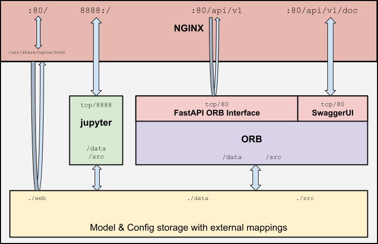

This directory contains sample code for an ORB Client implementation using [Skyspark](https://skyfoundry.com/product).

The client code is contained within the `.trio` files in this directory.

## ORB Reporting Tool

## ORB Test configuration utility

## WiFi Connections by Floor

## Demonstration Client application data flows

## ORB API Docker container structure

