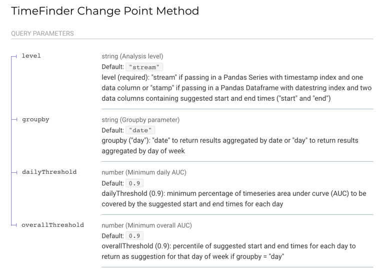
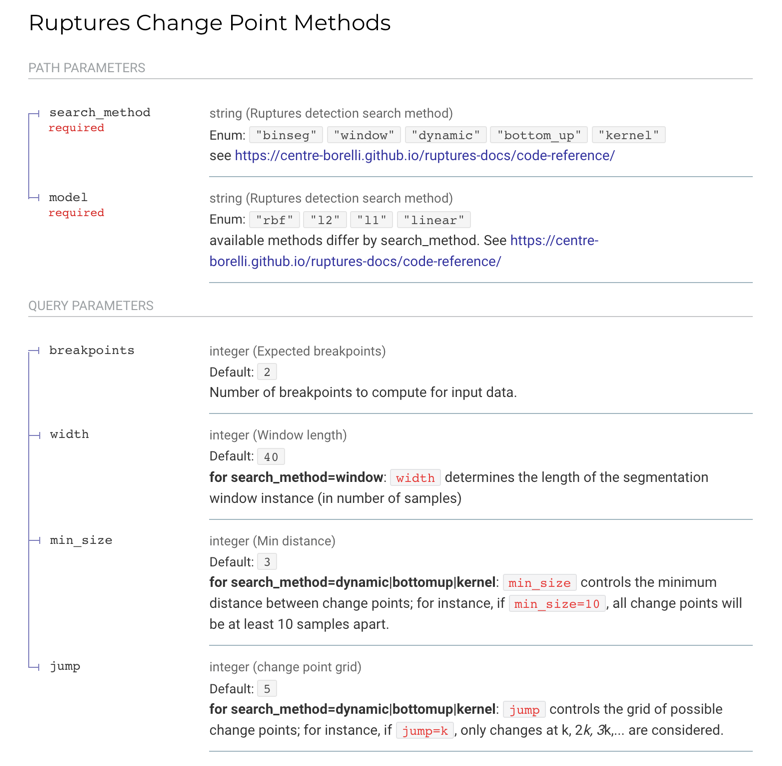

# API Overview

This is the source code for the Occupant Responsive Buildings API. This code is configured to run within the **orb** container defined in the [docker-compose.yml](../docker-compose.yml) file located in the root directory. This code is provided to demonstrate the use of open standards in API development to implement a relatively simple single-purpose API for integration between python applications and live deployments of Energy Management and Information Systems.  

This application uses the [FastAPI framework](https://fastapi.tiangolo.com/) to implement asynchronous python applications. FastAPI is built upon the [OpenAPI 3.1.0 Specification](https://github.com/OAI/OpenAPI-Specification/blob/main/versions/3.1.0.md), providing robust input validation and automatically generated interactive documentation via the [Swagger UI](https://github.com/swagger-api/swagger-ui).

The API root is defined in [main.py](main.py), which imports three `router` endpoints from [analyze.py](orb/routers/analyze.py), [models.py](orb/routers/models.py), and [predict.py](orb/routers/predict.py). Each endpoint is an independent application.

# Endpoints

## `POST api/v1/analyze/json`

## `POST api/v1/models/{search_method}/{model}/json`

## `POST api/v1/predict`
### Estimate future start/stop times based on historical data using the Prophet library
Not implemented.

# Request body schema - Haystack Grid 
    {
      "_kind": "grid",
      "meta": {
        "hisStart": {
          "_kind": "dateTime",
          "tz": "Los_Angeles",
          "val": "2021-06-22T00:00:00-07:00"
        },
        "hisEnd": { ... }
      },
      "cols": [
        {
          "name": "ts",
          "meta": {
            "tz": "Los_Angeles"
          }
        },
        {
          "name": "v0",
          "meta": { ... }
        }
      ],
      "rows": [
        {
          "ts": {
            "_kind": "dateTime",
            "tz": "Los_Angeles",
            "val": "2021-06-21T23:55:00-07:00"
          },
          "v0": {
            "_kind": "number",
            "val": 67.01000213623047,
            "unit": "°F"
          }
        },
        {
          "ts": { ... },
          "v0": { ... }
        }
      ]
    }
